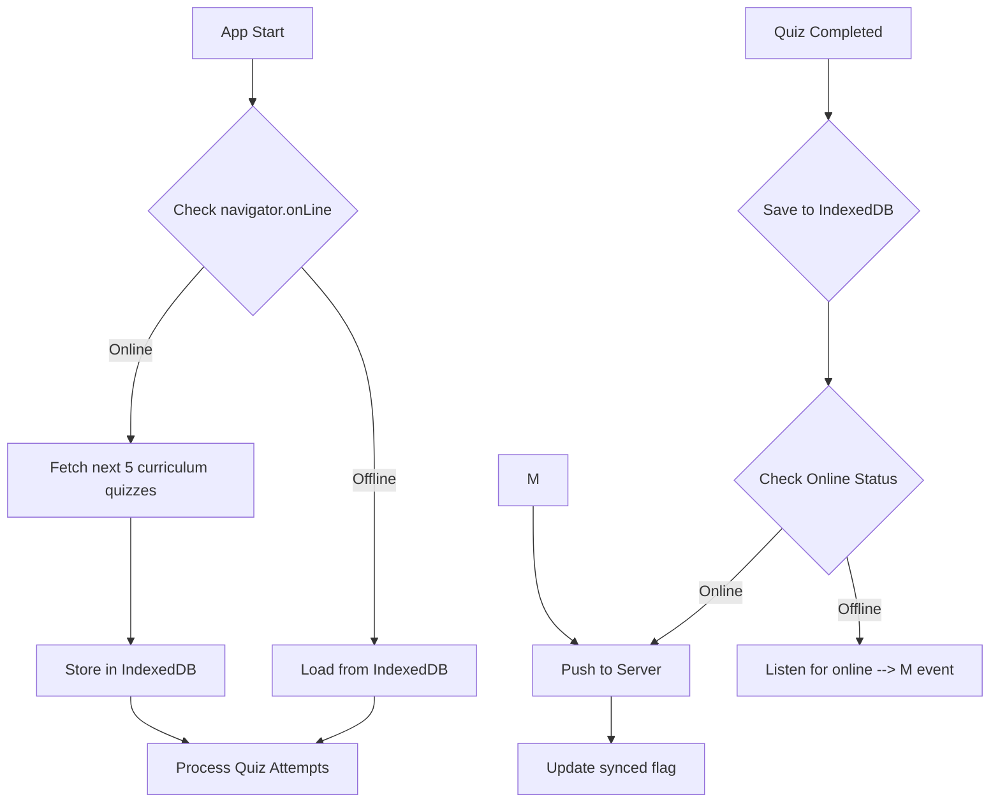

# StudyMate MVP - Architecture Specification

## 1. Project Overview

**Project Name:** StudyMate MVP  
**Type:** Offline-First Progressive Web App (PWA)  
**Target Audience:** Nigerian secondary school students (SSS 1-3) with focus on 2025/26 NERDC streamlined subjects
**Tone:** Supportive, Gamified (Duolingo-style), and Predictive

### Technology Stack

| Layer | Technology | Purpose |
|-------|------------|---------|
| Frontend Framework | React 18 + Vite | UI development, PWA foundation |
| Styling | Tailwind CSS | Rapid responsive styling |
| Animations | Framer Motion | Smooth transitions & loading states |
| Local Database | IndexedDB (via Dexie.js) | Offline data persistence |
| AI/OCR | Google Gemini 2.5 Flash + Cloud Vision | Text extraction & quiz generation (1M token context)
| State Management | Zustand | Lightweight reactive state |
| PWA | Workbox | Service worker & offline caching |
| HTTP Client | Axios | API communication |

---

## 2. Psychometric Profile Engine

### 2.1 Learning Persona JSON Schema

The psychometric profile is extracted from Screen 1 (onboarding quiz) and passed as `system_context` to every AI prompt.

```json
{
  "$schema": "http://json-schema.org/draft-07/schema#",
  "type": "object",
  "title": "Learning Persona",
  "description": "Student's psychometric profile derived from onboarding assessment",
  "properties": {
    "studentId": {
      "type": "string",
      "description": "Unique student identifier"
    },
    "personaType": {
      "type": "string",
      "enum": ["visual", "auditory", "kinesthetic", "reading", "mixed"],
      "description": "Primary learning style"
    },
    "cognitiveProfile": {
      "type": "object",
      "properties": {
        "processingSpeed": {
          "type": "number",
          "minimum": 1,
          "maximum": 10,
          "description": "How quickly student processes information"
        },
        "memoryStrength": {
          "type": "string",
          "enum": ["short_term", "long_term", "working", "visual", "auditory"],
          "description": "Dominant memory type"
        },
        "attentionSpan": {
          "type": "number",
          "minimum": 5,
          "maximum": 60,
          "description": "Minutes before losing focus"
        },
        "criticalThinking": {
          "type": "number",
          "minimum": 1,
          "maximum": 10,
          "description": "Analytical reasoning level"
        },
        "eqBaseline": {
          "type": "string",
          "enum": ["encouraging", "direct", "analytic"],
          "description": "Emotional intelligence tone for AI interactions"
        }
      },
      "required": ["processingSpeed", "memoryStrength", "attentionSpan"]
    },
    "subjectStrengths": {
      "type": "array",
      "items": {
        "type": "object",
        "properties": {
          "subject": { "type": "string" },
          "proficiency": { "type": "number", "minimum": 1, "maximum": 10 },
          "interest": { "type": "number", "minimum": 1, "maximum": 10 }
        }
      },
      "description": "Subject-level strengths and interests"
    },
    "preferredDifficulty": {
      "type": "string",
      "enum": ["easy", "medium", "hard", "adaptive"],
      "description": "Initial quiz difficulty preference"
    },
    "studyPatterns": {
      "type": "object",
      "properties": {
        "peakHours": {
          "type": "array",
          "items": { "type": "number" },
          "description": "Hours of day student learns best (0-23)"
        },
        "sessionDuration": {
          "type": "number",
          "minimum": 15,
          "maximum": 120,
          "description": "Preferred study session length in minutes"
        },
        "breakFrequency": {
          "type": "number",
          "minimum": 1,
          "maximum": 6,
          "description": "Breaks per hour"
        }
      }
    },
    "createdAt": {
      "type": "string",
      "format": "date-time"
    },
    "updatedAt": {
      "type": "string",
      "format": "date-time"
    }
  },
  "required": ["studentId", "personaType", "cognitiveProfile", "subjectStrengths", "preferredDifficulty"]
}
```

### 2.2 System Context Template

Every AI prompt receives this structured context:

```
SYSTEM: Acting as a {personaType} mentor for a {cognitiveProfile} student in the Nigerian SSS {level} curriculum.
Tone: {eqBaseline} (based on EQ baseline)

CONTEXT:
- Processing Speed: {processingSpeed}/10
- Memory Type: {memoryStrength}
- Attention Span: {attentionSpan} minutes
- Critical Thinking: {criticalThinking}/10
- Peak Study Hours: {peakHours}
- Current Difficulty: {preferredDifficulty}
- Subject Focus: {currentSubject}
```

### 2.3 Evolving Psychometric Avatar

The Psychometric Avatar is an animated character that evolves visually based on the student's progress and study habits.

| Evolution Trigger | Visual Change | Animation |
|-------------------|---------------|-----------|
| Quiz completed | Add XP glow | Pulse effect |
| 7-day streak | Level up | Celebration particles |
| Weak topic mastered | Unlock new accessory | Unlock animation |
| Study habit change | Update expression | Smooth morph |

**Component Architecture:**
```typescript
interface AvatarState {
  level: number;           // Current avatar level
  xp: number;             // Total XP earned
  streak: number;         // Current streak days
  unlockedAccessories: string[];
  mood: 'happy' | 'focused' | 'excited' | 'proud';
  expression: 'smile' | 'thinking' | 'celebrating';
}
```

**Gamification Elements:**
- XP (Experience Points): Earned per quiz completion
- Streak Counter: Consecutive days of study
- Level System: 1-50 with unlockable features
- Badges: Subject mastery achievements

---

## 3. Hybrid Storage Logic (IndexedDB)

### 3.1 Database Schema (Dexie.js)

```typescript
// Database: StudyMateDB
// Version: 1

interface StudentProfile {
  id?: number;
  studentId: string;
  name: string;
  grade: string; // JSS1, JSS2, JSS3, SS1, SS2, SS3
  persona: LearningPersona;
  createdAt: Date;
  updatedAt: Date;
}

interface Quiz {
  id?: number;
  quizId: string;
  subject: string;
  topic: string;
  grade: string;
  questions: Question[];
  difficulty: 'easy' | 'medium' | 'hard';
  source: 'curriculum' | 'note_upload';
  syncedAt?: Date;
  expiresAt: Date;
}

interface Question {
  id: string;
  text: string;
  options: { id: string; text: string }[];
  correctOptionId: string;
  explanation: string;
  cognitiveLevel: 'remember' | 'understand' | 'apply' | 'analyze' | 'evaluate';
}

interface QuizAttempt {
  id?: number;
  attemptId: string;
  quizId: string;
  studentId: string;
  answers: { questionId: string; selectedOptionId: string; isCorrect: boolean }[];
  score: number;
  totalQuestions: number;
  timeSpent: number; // seconds
  completedAt: Date;
  synced: boolean;
  syncedAt?: Date;
}

interface NoteUpload {
  id?: number;
  uploadId: string;
  studentId: string;
  fileName: string;
  fileType: 'image' | 'pdf';
  extractedText?: string;
  generatedQuiz?: Quiz;
  status: 'pending' | 'processing' | 'completed' | 'failed';
  errorMessage?: string;
  createdAt: Date;
  processedAt?: Date;
}

interface SyncQueue {
  id?: number;
  id: string;
  action: 'quiz_attempt' | 'profile_update';
  payload: any;
  createdAt: Date;
  retryCount: number;
  status: 'pending' | 'processing' | 'failed';
}
```

### 3.2 Sync Engine Flow



### 3.3 Curriculum Quiz Fetching - Priority-Based Sync

**Sync Priority Logic:**
1. **Priority 1:** Sync Psychometric DNA first
2. **Priority 2:** Download 5 quizzes based on student's *weakest* curriculum topics
3. **Priority 3:** Queue offline "Level Ups" or "XP gains" for sync

**Endpoint:** `GET /api/v1/quizzes/next?studentId={id}&grade={grade}&weakestTopics=true&count=5`

**Response:**
```json
{
  "quizzes": [
    {
      "quizId": "quiz_001",
      "subject": "Mathematics",
      "topic": "Algebra - Linear Equations",
      "grade": "SSS1",
      "questions": [...],
      "difficulty": "medium",
      "priorityReason": "weakest_topic"
    }
  ],
  "weakestTopics": ["Algebra", "Trigonometry"],
  "syncToken": "abc123"
}
```

---

## 4. Note-to-Quiz Pipeline - "Snap-to-Study"

### 4.1 Pipeline Architecture - Multimodal OCR

**Key Enhancement:** Use Google Cloud Vision to capture not just text, but the *spatial layout* of handwritten notes (diagrams, underlines, bullet points) to inform quiz structure.

```mermaid
graph LR
    A[User Uploads<br/>Image/PDF] --> B[Google Cloud Vision<br/>Multimodal OCR]
    B --> C[Extract: Text + Layout]
    C --> D[Detect: Diagrams, Bullets, Underlines]
    D --> E[Construct AI Prompt<br/>with Layout Context]
    E --> F[Google Gemini API<br/>with Persona Context]
    F --> G[Generated MCQs<br/>+ Study Tips]
    G --> H[Parse & Validate]
    H --> I[Save to IndexedDB]
    I --> J[Display to User]
```



**OCR Output Enhancement:**
```typescript
interface MultimodalOCRResult {
  rawText: string;
  spatialLayout: {
    paragraphs: { text: string; x: number; y: number; width: number; height: number }[];
    lists: { items: string[]; type: 'bullet' | 'numbered' }[];
    underlinedWords: string[];
    diagrams: { description: string; confidence: number }[];
  };
  handwrittenRegions: { text: string; confidence: number }[];
}
```

### 4.2 LLM Prompt Template

```
SYSTEM: You are an expert Nigerian curriculum educator. Generate quiz questions based on the provided text.

STUDENT CONTEXT:
- Learning Style: {personaType}
- Processing Speed: {processingSpeed}/10 (adjust question complexity accordingly)
- Memory Type: {memoryStrength}
- Attention Span: {attentionSpan} minutes (keep questions focused)
- Critical Thinking: {criticalThinking}/10

CURRICULUM: Nigerian National Curriculum (JSS1-SS3)

TASK:
From the following extracted text, generate:
1. 10 Multiple Choice Questions (4 options each)
2. 3 Study Tips personalized to the student's learning persona

OUTPUT FORMAT (JSON):
{
  "questions": [
    {
      "id": "q1",
      "text": "Question text",
      "options": [
        {"id": "a", "text": "Option A"},
        {"id": "b", "text": "Option B"},
        {"id": "c", "text": "Option C"},
        {"id": "d", "text": "Option D"}
      ],
      "correctOptionId": "a",
      "explanation": "Why this is correct",
      "cognitiveLevel": "remember|understand|apply|analyze|evaluate"
    }
  ],
  "studyTips": [
    {"title": "Tip 1", "description": "..."}
  ]
}

EXTRACTED TEXT:
{extractedText}
```

### 4.3 Processing States

| Status | Description | UI Action |
|--------|-------------|-----------|
| pending | File uploaded, awaiting OCR | Show spinner |
| processing | OCR complete, calling Gemini | Show progress bar |
| completed | Quiz generated successfully | Show quiz card |
| failed | Error in processing | Show error + retry button |

---

## 5. CBT Engine (Quiz Component)

### 5.1 Component Architecture

```
QuizContainer
├── QuizHeader (timer, progress, subject)
├── QuestionCard (animated)
│   ├── QuestionText
│   └── OptionsList
│       └── OptionButton (selectable)
├── QuizFooter
│   ├── NavigationControls
│   └── SubmitButton
└── ResultsModal
    ├── ScoreDisplay
    ├── QuestionReview
    └── StudyTips
```

### 5.2 Offline-First Behavior

| Scenario | Behavior |
|----------|----------|
| Start quiz offline | Load from IndexedDB, allow completion |
| Submit quiz offline | Store attempt in IndexedDB, queue for sync |
| Timer expires offline | Save partial attempt with `completedAt` = null |
| Resume online | Sync pending attempts before starting new |

### 5.3 Score Caching Logic

```typescript
// On quiz completion
async function saveQuizAttempt(attempt: QuizAttempt): Promise<void> {
  // Always save locally first
  await db.quizAttempts.add(attempt);
  
  // Queue for sync
  await db.syncQueue.add({
    action: 'quiz_attempt',
    payload: attempt,
    createdAt: new Date(),
    retryCount: 0,
    status: 'pending'
  });
  
  // Attempt immediate sync if online
  if (navigator.onLine) {
    await syncPendingAttempts();
  }
}

// Sync queue processor
async function syncPendingAttempts(): Promise<void> {
  const pending = await db.syncQueue
    .where('status')
    .equals('pending')
    .toArray();
    
  for (const item of pending) {
    try {
      await api.post('/api/v1/attempts', item.payload);
      await db.syncQueue.delete(item.id!);
      await db.quizAttempts.where('attemptId').equals(item.payload.attemptId)
        .modify({ synced: true, syncedAt: new Date() });
    } catch (error) {
      await db.syncQueue.where('id').equals(item.id!)
        .modify({ retryCount: item.retryCount + 1, status: 'failed' });
    }
  }
}

// Listen for connectivity
window.addEventListener('online', syncPendingAttempts);
```

---

## 6. UI/UX Specifications

### 6.1 Design System

#### Color Palette (Tailwind) - "Naija-Modern"

| Token | Hex | Usage |
|-------|-----|-------|
| primary | #10B981 (emerald-500) | Main actions, headers |
| primary-dark | #059669 (emerald-600) | Hover states |
| secondary | #F59E0B (amber-500) | Highlights, scores |
| accent | #8B5CF6 (violet-500) | AI features
| highlight | #F97316 (orange-500) | Coral - XP, scores, rewards |
| success | #10B981 (emerald-500) | Correct answers |
| error | #EF4444 (red-500) | Wrong answers |
| background | #F8FAFC (slate-50) | Page background |
| surface | #FFFFFF | Cards, modals |
| text-primary | #1E293B (slate-800) | Headings |
| text-secondary | #64748B (slate-500) | Body text |

#### Typography

| Element | Font | Size | Weight |
|---------|------|------|--------|
| H1 | Inter | 32px | 700 |
| H2 | Inter | 24px | 600 |
| H3 | Inter | 20px | 600 |
| Body | Inter | 16px | 400 |
| Caption | Inter | 14px | 400 |
| Button | Inter | 16px | 500 |

### 6.2 Screen Structure - "The Anti-Menu"

**Navigation Philosophy:** No sidebars or bottom navigation bars. Use vertical "Quest Map" for curriculum and persistent "Hero Camera Button" for Note-to-Quiz.

```
├── SplashScreen (PWA loading)
├── Onboarding (Screen 1 - "Vibe Check")
│   ├── WelcomeIntro
│   ├── PsychometricQuiz
│   └── PersonaResult (with Evolving Avatar)
├── HomeScreen (Quest Hub)
│   ├── EvolvingPsychometricAvatar
│   ├── QuestMap (vertical curriculum navigation)
│   ├── QuickStats (XP, streak, level)
│   └── StudyTips
├── QuizScreen
│   ├── QuizTimer
│   ├── QuestionView
│   └── ResultsView (with XP animation)
├── NoteUploadScreen (Snap-to-Study)
│   ├── HeroCameraButton (persistent FAB)
│   ├── FilePicker
│   ├── ProcessingStatus (skeleton screens)
│   └── GeneratedQuiz
├── ProfileScreen
│   ├── PersonaCard
│   ├── ProgressStats
│   └── Settings
└── OfflineIndicator (global)
```

**Persistent UI Elements:**
- Hero Camera Button: Floating action button (bottom-right) for instant Note-to-Quiz access
- Quest Map: Vertical scrolling list of curriculum topics as "quests"

### 6.3 Framer Motion Animations

| Animation | Trigger | Properties |
|-----------|----------|------------|
| Screen transition | Route change | fade + slideX (300ms) |
| Question flip | Next question | rotateY (400ms) |
| Score reveal | Quiz complete | scale (0→1) + confetti |
| Loading skeleton | Data fetching | shimmer effect |
| Option select | Click | scale (1→0.95→1) + border color |
| Progress bar | Quiz progress | width animate |
| Offline banner | Connection loss | slideY from top |

### 6.4 Responsive Breakpoints

| Breakpoint | Width | Layout |
|------------|-------|--------|
| Mobile | < 640px | Single column, bottom nav |
| Tablet | 640-1024px | Two columns, side nav |
| Desktop | > 1024px | Max width 1280px, centered |

---

## 7. Backend API Specification

### 7.1 Endpoints (Express.js)

| Method | Endpoint | Description |
|--------|----------|-------------|
| GET | `/api/v1/quizzes/next` | Fetch next 5 curriculum quizzes |
| GET | `/api/v1/quizzes/:id` | Get specific quiz |
| POST | `/api/v1/attempts` | Submit quiz attempt |
| GET | `/api/v1/attempts/:studentId` | Get student's attempt history |
| POST | `/api/v1/profiles/sync` | Sync student profile |
| GET | `/api/v1/curriculum/:grade/:subject` | Get curriculum topics |

### 7.2 Database (PostgreSQL)

```sql
-- Students table
CREATE TABLE students (
  id UUID PRIMARY KEY DEFAULT gen_random_uuid(),
  student_id VARCHAR(50) UNIQUE NOT NULL,
  name VARCHAR(100),
  grade VARCHAR(10),
  persona JSONB,
  created_at TIMESTAMP DEFAULT NOW(),
  updated_at TIMESTAMP DEFAULT NOW()
);

-- Quizzes table
CREATE TABLE quizzes (
  id UUID PRIMARY KEY DEFAULT gen_random_uuid(),
  quiz_id VARCHAR(50) UNIQUE NOT NULL,
  subject VARCHAR(50) NOT NULL,
  topic VARCHAR(100) NOT NULL,
  grade VARCHAR(10) NOT NULL,
  questions JSONB NOT NULL,
  difficulty VARCHAR(20),
  created_at TIMESTAMP DEFAULT NOW()
);

-- Quiz attempts table
CREATE TABLE quiz_attempts (
  id UUID PRIMARY KEY DEFAULT gen_random_uuid(),
  attempt_id VARCHAR(50) UNIQUE NOT NULL,
  quiz_id VARCHAR(50) REFERENCES quizzes(quiz_id),
  student_id VARCHAR(50) REFERENCES students(student_id),
  answers JSONB NOT NULL,
  score INTEGER NOT NULL,
  total_questions INTEGER NOT NULL,
  time_spent INTEGER,
  completed_at TIMESTAMP NOT NULL,
  synced_at TIMESTAMP DEFAULT NOW()
);
```

---

## 8. Project Folder Structure

```
studymate-mvp/
├── public/
│   ├── manifest.json
│   ├── sw.js
│   ├── icons/
│   └── offline.html
├── src/
│   ├── main.tsx
│   ├── App.tsx
│   ├── index.css
│   ├── vite-env.d.ts
│   ├── components/
│   │   ├── common/
│   │   │   ├── Button.tsx
│   │   │   ├── Card.tsx
│   │   │   ├── Loader.tsx
│   │   │   └── OfflineBanner.tsx
│   │   ├── quiz/
│   │   │   ├── QuizContainer.tsx
│   │   │   ├── QuestionCard.tsx
│   │   │   ├── OptionButton.tsx
│   │   │   ├── QuizTimer.tsx
│   │   │   └── ResultsView.tsx
│   │   ├── notes/
│   │   │   ├── NoteUploader.tsx
│   │   │   ├── ProcessingStatus.tsx
│   │   │   └── GeneratedQuizCard.tsx
│   │   ├── profile/
│   │   │   ├── PersonaCard.tsx
│   │   │   └── PsychometricQuiz.tsx
│   │   └── layout/
│   │       ├── Header.tsx
│   │       ├── BottomNav.tsx
│   │       └── ScreenWrapper.tsx
│   ├── pages/
│   │   ├── Splash.tsx
│   │   ├── Onboarding.tsx
│   │   ├── Home.tsx
│   │   ├── Quiz.tsx
│   │   ├── NoteUpload.tsx
│   │   └── Profile.tsx
│   ├── hooks/
│   │   ├── useOnlineStatus.ts
│   │   ├── useSync.ts
│   │   ├── useQuiz.ts
│   │   └── usePersona.ts
│   ├── stores/
│   │   ├── useStudentStore.ts
│   │   ├── useQuizStore.ts
│   │   └── useSyncStore.ts
│   ├── services/
│   │   ├── api.ts
│   │   ├── ocr.ts
│   │   ├── llm.ts
│   │   └── sync.ts
│   ├── db/
│   │   ├── database.ts (Dexie setup)
│   │   ├── schemas.ts
│   │   └── queries.ts
│   ├── utils/
│   │   ├── persona.ts
│   │   ├── curriculum.ts
│   │   └── constants.ts
│   └── types/
│       ├── persona.ts
│       ├── quiz.ts
│       └── api.ts
├── server/
│   ├── index.js
│   ├── routes/
│   │   ├── quizzes.js
│   │   ├── attempts.js
│   │   └── profiles.js
│   ├── db/
│   │   └── postgres.js
│   └── services/
│       └── quizGenerator.js
├── tailwind.config.js
├── vite.config.ts
├── tsconfig.json
├── package.json
└── SPEC.md
```

---

## 9. PWA Configuration

### 9.1 Service Worker Strategy

| Resource Type | Caching Strategy |
|---------------|------------------|
| Static assets (JS, CSS) | Cache First |
| API responses | Network First with fallback |
| Images | Cache First with expiration |
| Quiz data | IndexedDB (custom) |

### 9.2 manifest.json

```json
{
  "name": "StudyMate - AI Learning Companion",
  "short_name": "StudyMate",
  "description": "Offline-first AI-powered learning app for Nigerian students",
  "start_url": "/",
  "display": "standalone",
  "background_color": "#F8FAFC",
  "theme_color": "#0D9488",
  "orientation": "portrait-primary",
  "icons": [
    {
      "src": "/icons/icon-192.png",
      "sizes": "192x192",
      "type": "image/png"
    },
    {
      "src": "/icons/icon-512.png",
      "sizes": "512x512",
      "type": "image/png"
    }
  ]
}
```

---

## 10. Acceptance Criteria

### 10.1 Psychometric Profile
- [ ] Student completes onboarding quiz
- [ ] Persona is calculated and stored in IndexedDB
- [ ] Persona is included in all AI prompts

### 10.2 Hybrid Storage
- [ ] App works 100% offline after initial load
- [ ] 5 quizzes are cached when online
- [ ] Quiz attempts are queued when offline
- [ ] Sync occurs automatically when online

### 10.3 Note-to-Quiz Pipeline
- [ ] User can upload image or PDF
- [ ] OCR extracts text accurately
- [ ] LLM generates 10 MCQs + 3 study tips
- [ ] Output is saved to local storage immediately

### 10.4 CBT Engine
- [ ] Quiz works completely offline
- [ ] Timer functions offline
- [ ] Scores are cached locally
- [ ] Scores sync when connection restored

### 10.5 UI/UX
- [ ] Tailwind CSS is used for all styling
- [ ] Framer Motion provides smooth transitions
- [ ] PWA is installable on mobile
- [ ] Offline indicator is visible when disconnected
