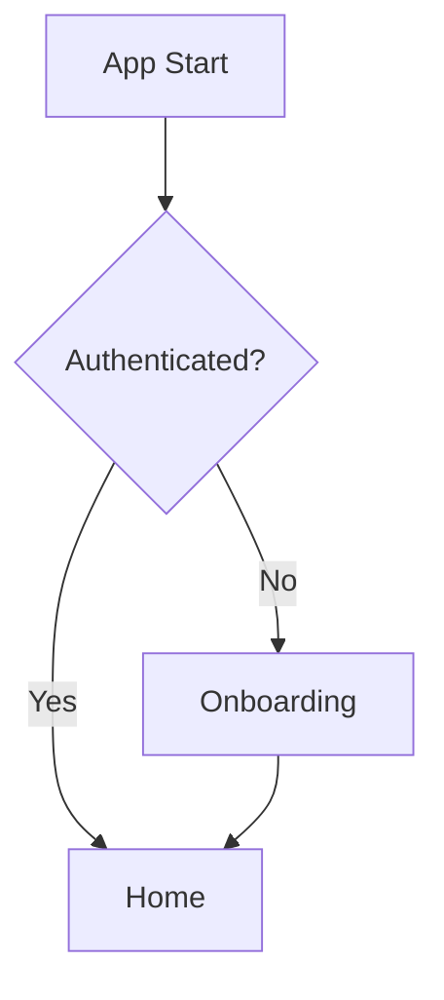
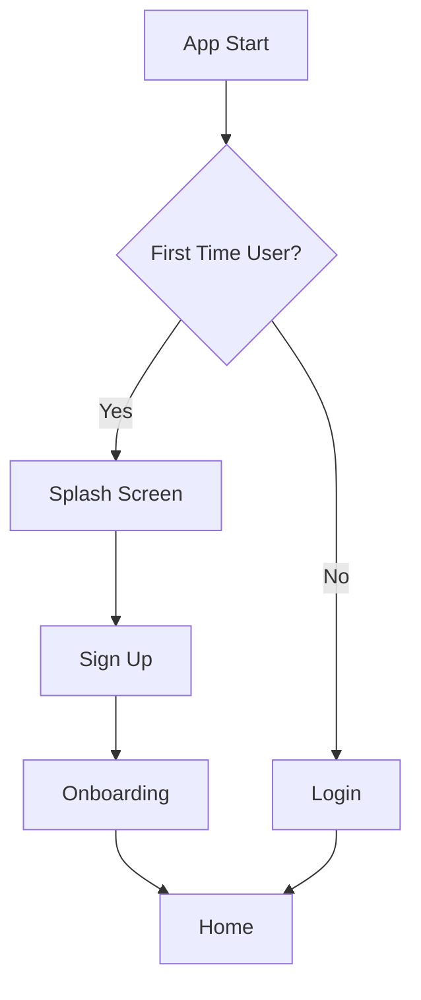

# New User Flow Architecture

## Overview
This document outlines the new user flow architecture for StudyMate, where new users will experience a welcome splash screen first, followed by a sign-up page and onboarding telemetry collection screen before reaching the main application lobby (home page).

## Current vs New Flow

### Current Flow


### New Flow


## Key Changes

### 1. Splash Screen
- New page component: `src/pages/Splash.tsx`
- Features:
  - Welcome message with StudyMate branding
  - "Get Started" button for new users
  - "Sign In" option for existing users
  - Animated background or visual effects

### 2. Sign Up Page
- New page component: `src/pages/SignUp.tsx`
- Features:
  - Email/Username input
  - Password input with validation
  - Confirm password field
  - Terms and conditions acceptance
  - "Create Account" button
  - "Already have an account? Sign In" link

### 3. Onboarding Improvements
- Enhanced page: `src/pages/Onboarding.tsx`
- New features:
  - Telemetry collection (anonymous data for research purposes)
  - Learning style assessment
  - Study preferences survey
  - Enhanced progress tracking

### 4. Routing Changes
- Modify `src/App.tsx` to:
  - Add new routes for splash and sign-up
  - Update redirect logic based on user state
  - Handle first-time user detection

### 5. State Management Updates
- Modify `src/stores/useAppStore.ts` to:
  - Add `hasSeenSplash` state
  - Add `isFirstTimeUser` state
  - Add `signUp` action
  - Enhance `loadStudent` to detect first-time users

## File Structure Changes

```
src/
├── pages/
│   ├── Splash.tsx          # New - Welcome screen
│   ├── SignUp.tsx          # New - User registration
│   ├── Onboarding.tsx      # Enhanced - Telemetry collection
│   ├── Login.tsx           # Existing - User login
│   ├── Home.tsx            # Existing - Main lobby
│   └── ...other pages
├── stores/
│   └── useAppStore.ts      # Updated - New state management
└── App.tsx                 # Updated - Routing changes
```

## Implementation Steps

1. Create the Splash Screen component
2. Create the Sign Up page component
3. Update the Onboarding page with telemetry collection
4. Modify the state management store
5. Update the main App.tsx routing logic
6. Test the complete flow
7. Add animations and transitions for better user experience

## Technical Considerations

### Routing
- Use React Router's `Navigate` component for redirects
- Implement route guards based on user state
- Handle history manipulation for proper back button behavior

### State Management
- Use Zustand for global state management
- Persist state to IndexedDB for future sessions
- Handle loading and error states

### Styling
- Follow existing theme system
- Use Framer Motion for animations
- Maintain responsive design for mobile devices

### Accessibility
- Ensure all forms are accessible
- Provide keyboard navigation
- Follow WCAG 2.0 guidelines

## Future Enhancements

- Social login integration
- Email verification process
- Forgot password functionality
- Multi-language support
