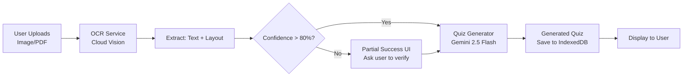

# Phase 2 Implementation Plan: Handwriting-to-JSON Bridge

## Overview
Implement the Note-to-Quiz pipeline that converts handwritten notes into interactive quizzes using OCR and Gemini AI.

## Current State (Phase 1 Complete)
- ✅ Dexie.js database schema implemented (`src/db/database.ts`)
- ✅ NoteUpload UI exists but is placeholder only
- ✅ App routing, stores, and gamification working

## Phase 2 Requirements
From "Project Next Steps.md":
- Integrate Google Cloud Vision OCR with Gemini 2.5 Flash API
- Implement "Partial Success" state - when handwriting is messy, ask user to verify unclear parts
- This builds user trust instead of just failing

---

## Architecture



---

## Implementation Steps

### Step 1: Create OCR Service
**File:** `src/services/ocr.ts`

```typescript
interface OCRResult {
  rawText: string;
  confidence: number;
  spatialLayout?: {
    paragraphs: { text: string; x: number; y: number }[];
    lists: { items: string[] }[];
  };
  unclearRegions?: { text: string; suggestion: string }[];
}

export async function processImage(file: File): Promise<OCRResult>
```

### Step 2: Create Quiz Generator Service
**File:** `src/services/quizGenerator.ts`

```typescript
interface QuizGenerationOptions {
  extractedText: string;
  studentPersona: LearningPersona;
  unclearRegions?: { text: string; suggestion: string }[];
}

export async function generateQuizFromNotes(options: QuizGenerationOptions): Promise<Quiz>
```

### Step 3: Create Note Upload Store
**File:** `src/stores/noteUploadStore.ts`

Manages the state of note upload processing:
- `uploadFile`: Store selected file
- `processNote`: Run OCR → Quiz Generation pipeline
- `handlePartialSuccess`: Process user verification of unclear regions
- States: idle, scanning, generating, partialSuccess, completed, error

### Step 4: Update NoteUpload Page
**File:** `src/pages/NoteUpload.tsx`

Replace placeholder with full implementation:
- Integrate noteUploadStore
- Show processing progress
- Handle partial success verification UI
- Display generated quiz with option to start

### Step 5: Add Processing States UI
Update NoteUpload to show:
1. **Scanning** - OCR in progress (scanner animation)
2. **Generating** - Gemini API call (quiz generation)
3. **Partial Success** - When OCR confidence < 80%, show unclear parts for verification
4. **Completed** - Show generated quiz preview
5. **Error** - Show retry option

---

## Key Features

### Partial Success Handling
```
When OCR confidence < 80%:
- Display: "I caught most of this, but can you double-check the part about [Topic]?"
- Show unclear regions with suggestions
- User can: Confirm, Edit, or Skip
- Build trust through transparency
```

### Persona Context Injection
Every prompt includes:
```
SYSTEM: Acting as a {personaType} mentor for a {cognitiveProfile} student
Tone: {eqBaseline}
- Processing Speed: {processingSpeed}/10
- Memory Type: {memoryStrength}
- Attention Span: {attentionSpan} minutes
```

---

## Integration Points

| Component | Integration |
|-----------|-------------|
| `src/db/database.ts` | NoteUpload table already exists |
| `src/stores/useAppStore.ts` | Load student persona for quiz generation |
| `src/pages/NoteUpload.tsx` | Replace placeholder with full implementation |
| `src/pages/Home.tsx` | Navigate to NoteUpload on "Snap to Study" click |

---

## Files to Create/Modify

### New Files
- `src/services/ocr.ts` - OCR service
- `src/services/quizGenerator.ts` - Quiz generation service  
- `src/stores/noteUploadStore.ts` - Note upload state management

### Modified Files
- `src/pages/NoteUpload.tsx` - Full implementation
- `src/App.tsx` - Add route for quiz preview if needed

---

## Testing Checklist
- [ ] Upload image → OCR extracts text
- [ ] OCR with low confidence → Partial success UI shows
- [ ] User confirms unclear regions → Quiz generates correctly
- [ ] Quiz saves to IndexedDB
- [ ] Navigate to generated quiz
- [ ] Offline mode - quiz still generates (if API cached)