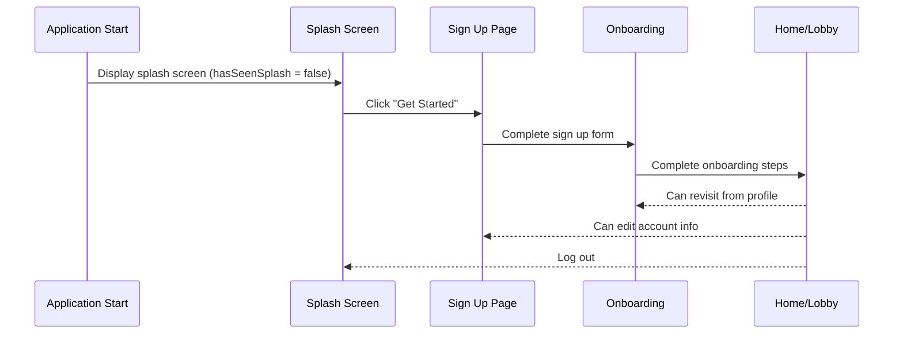
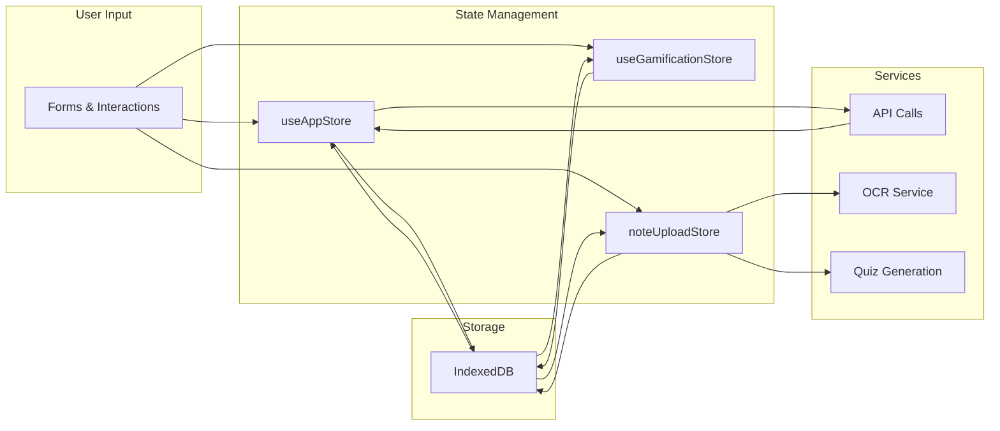
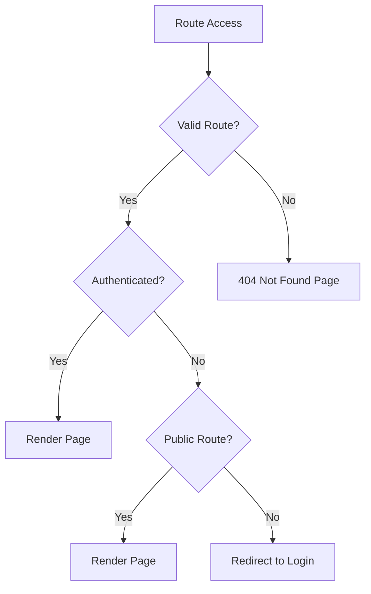

# StudyMate Screen Flow Diagram

## New User Flow (First-time users)



## Detailed Screen Navigation Diagram

```mermaid
graph TD
    A[Application Start] --> B{hasSeenSplash?}
    B -->|No| C[Splash Screen]
    B -->|Yes| D{isAuthenticated?}
    
    C --> E[Sign Up Page]
    C --> F[Login Page]
    
    E --> G[Onboarding Flow]
    E --> F
    
    G --> H[Home Page (Lobby)]
    
    D -->|Yes| H
    D -->|No| F
    
    F --> H
    
    H --> I[Note Upload]
    H --> J[Quiz Page]
    H --> K[Profile Page]
    
    I --> H
    J --> H
    K --> H
    
    K --> G
    K --> E
```

## Screen Details

### 1. Splash Screen (New Users Only)
- **File**: `src/pages/Splash.tsx`
- **Purpose**: Welcome and brand introduction
- **Actions**:
  - "Get Started" → Sign Up Page
  - "Sign In" → Login Page
- **Design**: Bold branding, gradient background, animated elements

### 2. Sign Up Page
- **File**: `src/pages/SignUp.tsx`
- **Purpose**: User registration
- **Fields**:
  - Username
  - Email
  - Password
  - Confirm Password
  - Terms & Conditions checkbox
- **Validation**: Real-time feedback on fields

### 3. Onboarding Flow
- **File**: `src/pages/Onboarding.tsx`
- **Purpose**: User profile creation and telemetry collection
- **Steps**:
  1. Personal information (name, grade)
  2. Learning style assessment
  3. Study preferences
  4. Telemetry consent (optional but recommended)
- **Visuals**: Dynamic progress indicator, animated transitions

### 4. Login Page
- **File**: `src/pages/Login.tsx`
- **Purpose**: Existing user authentication
- **Fields**:
  - Username
  - Password
- **Features**:
  - Show/hide password toggle
  - Error handling for invalid credentials

### 5. Home Page (Lobby)
- **File**: `src/pages/Home.tsx`
- **Purpose**: Main application hub
- **Sections**:
  - Recent quizzes
  - Recommended content
  - Quick actions (Note Upload, Create Quiz)
  - User stats (XP, gems, streak)
- **Navigation**:
  - Bottom navigation for main features
  - Profile access

### 6. Note Upload
- **File**: `src/pages/NoteUpload.tsx`
- **Purpose**: Capture and process notes
- **Features**:
  - Camera integration
  - OCR text extraction
  - PDF upload
  - Note management

### 7. Quiz Page
- **File**: `src/pages/Quiz.tsx`
- **Purpose**: Quiz taking and assessment
- **Features**:
  - Interactive quiz interface
  - Timer and scoring
  - Hint system
  - Results analysis

### 8. Profile Page
- **File**: `src/pages/Profile.tsx`
- **Purpose**: User settings and information
- **Sections**:
  - User profile card
  - Achievement badges
  - Study history
  - Settings (theme, notifications, log out)
- **Actions**:
  - Edit profile
  - Log out
  - Delete account

## Data Flow



## Technical Implementation

### Routing System
```typescript
// Key Routes in src/App.tsx
Routes: [
  { path: '/', element: <DefaultRedirect /> },
  { path: '/splash', element: <Splash /> },
  { path: '/signup', element: <SignUp /> },
  { path: '/login', element: <Login /> },
  { path: '/onboarding', element: <Onboarding /> },
  { 
    path: '/home', 
    element: <ProtectedRoute><Home /></ProtectedRoute> 
  },
  { 
    path: '/note-upload', 
    element: <ProtectedRoute><NoteUpload /></ProtectedRoute> 
  },
  { 
    path: '/quiz/:quizId', 
    element: <ProtectedRoute><QuizPage /></ProtectedRoute> 
  },
  { 
    path: '/profile', 
    element: <ProtectedRoute><Profile /></ProtectedRoute> 
  }
]
```

### State Management
```typescript
// Key States in useAppStore
interface AppState {
  isAuthenticated: boolean;
  currentStudent: StudentProfile | null;
  isOnboarded: boolean;
  hasSeenSplash: boolean;
  isFirstTimeUser: boolean;
  // ...other states
}

// Key Actions
interface AppState {
  login: (username: string, password: string) => Promise<boolean>;
  signUp: (username: string, email: string, password: string) => Promise<boolean>;
  logout: () => void;
  markSplashSeen: () => void;
  setFirstTimeUser: (value: boolean) => void;
  setCurrentStudent: (student: StudentProfile) => void;
  setOnboarded: (value: boolean) => void;
  // ...other actions
}
```

## Error Handling & Fallback Routes



## Accessibility Features

- **Keyboard Navigation**: All interactive elements focusable
- **Screen Reader Support**: ARIA labels and role attributes
- **Visual Contrast**: High contrast for readability
- **Responsive Design**: Works on various screen sizes
- **Focus Management**: Clear visual feedback on focus

## Performance Considerations

- **Lazy Loading**: Pages loaded on demand
- **Code Splitting**: Separate chunks for different routes
- **Caching**: Static assets and API responses cached
- **Image Optimization**: Compressed images with webp format
- **Animations**: Smooth transitions with Framer Motion
