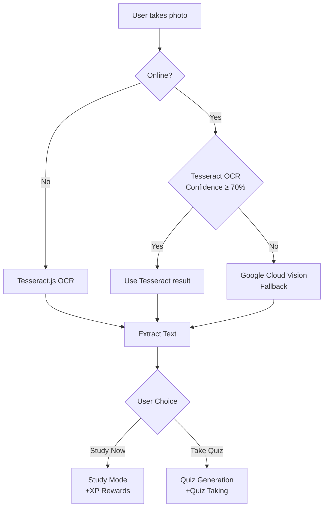

# Snap to Study Pipeline - Implementation Plan

## 1. Current Implementation Analysis

### Existing Flow:
```
User uploads photo → OCR (Tesseract.js + optional Cloud Vision) → Quiz Generation → Quiz
```

### Current Components:
- **[`src/pages/NoteUpload.tsx`](src/pages/NoteUpload.tsx)** - UI with states: idle → scanning → verifying → generating → completed
- **[`src/services/ocr.ts`](src/services/ocr.ts)** - Hybrid OCR: Tesseract.js (offline) + Google Cloud Vision (fallback)
- **[`src/services/quizGenerator.ts`](src/services/quizGenerator.ts)** - Quiz generation from extracted text
- **[`src/stores/noteUploadStore.ts`](src/stores/noteUploadStore.ts)** - State management for pipeline
- **[`src/stores/gamificationStore.ts`](src/stores/gamificationStore.ts)** - XP/gem system with `addXP()` method

### Current Gaps:
1. No user choice between "Study Now" vs "Take Quiz"
2. No Study Mode with XP rewards
3. OCR confidence threshold is already at 70% ✓
4. Offline support exists via Tesseract.js ✓

---

## 2. Proposed New Pipeline



### States Required:
| State | Description |
|-------|-------------|
| `idle` | No file selected |
| `scanning` | OCR in progress |
| `verifying` | Partial OCR success - user verifies unclear regions |
| `ready` | **NEW** - OCR complete, awaiting user choice |
| `generating` | Quiz generation in progress |
| `studying` | **NEW** - Study mode active |
| `completed` | Quiz generated OR Study session complete |
| `error` | Error occurred |

---

## 3. Implementation Tasks

### Phase 1: Enhance NoteUploadStore

#### Task 1.1: Add New State and Data
- Add `extractedText` to store (already exists)
- Add `ocrSource`: `'tesseract' | 'cloud-vision'`
- Add new state: `'ready'`
- Add `studySessionId` for tracking study sessions
- Add `studiedAt` timestamp

#### Task 1.2: Add Study Mode Actions
```typescript
// New store methods needed:
startStudyMode: () => void
completeStudySession: (timeSpent: number) => Promise<void>
```

### Phase 2: Create Study Mode Component

#### Task 2.1: Create StudyMode Component
- **File**: `src/components/study/StudyMode.tsx`
- Display extracted text in readable format
- Highlight key concepts (from OCR spatial data)
- Track reading time
- "Mark as Complete" button

#### Task 2.2: Create "Ready" State UI
- Display extracted text preview
- Show confidence score and source
- Two prominent buttons:
  - 🧠 **Study Now** - Enter study mode (+XP)
  - 📝 **Take Quiz** - Generate and take quiz

### Phase 3: Gamification Integration

#### Task 3.1: Add XP Configuration
- In `src/db/gamification.ts`, add XP rewards:
```typescript
studySession: {
  baseXP: 15,      // XP for completing study session
  perMinuteBonus: 2 // Bonus XP per minute studied
}
```

#### Task 3.2: Integrate XP in Study Mode
- Award XP when user completes study session
- Show XP earned animation (re-use existing `XPDisplay`)

### Phase 4: OCR Enhancement

#### Task 4.1: Ensure 70% Threshold
- Current code already uses 0.7 (70%) threshold ✓
- Verify fallback logic: if confidence < 70% AND online AND API key → use Cloud Vision

#### Task 4.2: Offline Indicator
- Add offline banner during OCR (use existing `OfflineBanner` component)
- Show which OCR engine is being used

---

## 4. API Key Security Strategy

### Recommended Approach: Environment Variables + Build-Time Injection

#### Step 4.1: Create Environment Configuration
Create `src/config/env.ts`:
```typescript
// Runtime environment variables (injected at build time)
export const config = {
  googleCloudVisionApiKey: import.meta.env.VITE_GOOGLE_CLOUD_VISION_API_KEY || '',
  geminiApiKey: import.meta.env.VITE_GEMINI_API_KEY || '',
};
```

#### Step 4.2: Create .env.example
```
# Google Cloud Vision API Key (for OCR fallback)
VITE_GOOGLE_CLOUD_VISION_API_KEY=your_api_key_here

# Gemini API Key (for quiz generation)
VITE_GEMINI_API_KEY=your_api_key_here
```

#### Step 4.3: Add .env to .gitignore
```
.env
.env.local
.env.*.local
```

#### Step 4.4: Update OCR Service
Modify `src/services/ocr.ts`:
```typescript
import { config } from '../config/env';

export async function processImage(file: File, config: OCRConfig = {}): Promise<OCRResult> {
  // Use API key from config
  const apiKey = config.apiKey || config.googleCloudVisionApiKey;
  // ... rest of logic
}
```

### Alternative: Vite Environment Variables (Recommended)

Vite already supports `import.meta.env.VITE_*` variables. The app should:

1. **For Development**: Create `.env.local` with test keys
2. **For Production**: 
   - Option A: Set environment variables in deployment platform (Vercel, Netlify)
   - Option B: Use a simple backend proxy (recommended for production)

### Security Best Practices:
- **Never commit actual API keys** to version control
- Use **service account credentials** with limited permissions for GCV
- Implement **API key rotation** strategy
- Add **usage quotas** to Google Cloud project
- Consider **backend proxy** in production to hide keys completely

---

## 5. Detailed Component Changes

### 5.1 NoteUploadStore Changes

```typescript
// New state type
export type NoteUploadState = 
  | 'idle'
  | 'scanning'
  | 'verifying'
  | 'ready'        // NEW: OCR complete, awaiting user choice
  | 'generating'
  | 'studying'     // NEW: In study mode
  | 'completed'
  | 'error';

// New store interface additions
interface NoteUploadStore {
  // ... existing fields
  ocrSource: 'tesseract' | 'cloud-vision';
  studyStartTime: number | null;
  
  // New actions
  setReady: (text: string, confidence: number, source: string) => void;
  startStudyMode: () => void;
  completeStudySession: () => Promise<void>;
  goToQuiz: () => void;
}
```

### 5.2 NoteUpload.tsx Changes

```typescript
// Add new render function for 'ready' state
function RenderReady({ 
  extractedText, 
  confidence, 
  ocrSource,
  onStudyNow, 
  onTakeQuiz 
}) {
  return (
    <div className="space-y-6">
      {/* Text Preview */}
      <div className="bg-white/10 rounded-xl p-4">
        <p className="text-white text-sm line-clamp-6">{extractedText}</p>
      </div>
      
      {/* OCR Info */}
      <div className="flex justify-between text-white/60 text-sm">
        <span>Confidence: {Math.round(confidence * 100)}%</span>
        <span>Source: {ocrSource}</span>
      </div>
      
      {/* Choice Buttons */}
      <button onClick={onStudyNow} className="btn-primary">
        🧠 Study Now (+XP)
      </button>
      <button onClick={onTakeQuiz} className="btn-secondary">
        📝 Take Quiz
      </button>
    </div>
  );
}
```

### 5.3 New StudyMode Component

```typescript
// src/components/study/StudyMode.tsx
export function StudyMode({ 
  extractedText, 
  onComplete 
}: { 
  extractedText: string; 
  onComplete: () => void;
}) {
  const [startTime] = useState(Date.now());
  const [isComplete, setIsComplete] = useState(false);
  
  // Calculate XP earned
  const timeSpent = Math.floor((Date.now() - startTime) / 1000);
  const baseXP = 15;
  const timeBonus = Math.floor(timeSpent / 60) * 2;
  const totalXP = baseXP + timeBonus;
  
  return (
    <div className="study-mode">
      {/* Scrollable text content */}
      <div className="text-content">
        {extractedText}
      </div>
      
      {/* XP Preview */}
      <XPDisplay value={totalXP} label="Potential XP" />
      
      {/* Complete Button */}
      <button onClick={() => {
        setIsComplete(true);
        onComplete();
      }}>
        Mark as Complete
      </button>
    </div>
  );
}
```

---

## 6. Implementation Checklist

- [ ] **Phase 1**: Update NoteUploadStore with new states and actions
- [ ] **Phase 2**: Add "ready" state UI in NoteUpload.tsx
- [ ] **Phase 3**: Create StudyMode component
- [ ] **Phase 4**: Integrate XP rewards for study sessions
- [ ] **Phase 5**: Add environment configuration for API keys
- [ ] **Phase 6**: Test offline functionality
- [ ] **Phase 7**: Test Cloud Vision fallback

---

## 7. XP Reward System

| Action | XP Award | Notes |
|--------|----------|-------|
| Complete Study Session | 15 XP | Base reward |
| Study Time Bonus | +2 XP/min | After first minute |
| Quiz from Notes | 10 XP | Quiz completion bonus |

---

## 8. Files to Modify

| File | Changes |
|------|---------|
| `src/stores/noteUploadStore.ts` | Add ready/studying states, study actions |
| `src/pages/NoteUpload.tsx` | Add ready state UI, study mode integration |
| `src/components/study/StudyMode.tsx` | **NEW** - Study mode component |
| `src/db/gamification.ts` | Add study session XP config |
| `src/config/env.ts` | **NEW** - Environment config |
| `.env.example` | **NEW** - API key template |
| `.gitignore` | Add .env files |

---

## 9. Testing Considerations

1. **Offline Mode**: Test with network disabled - should use Tesseract.js only
2. **Low Confidence**: Test with blurry image - should show Cloud Vision fallback
3. **Study Mode XP**: Verify XP is awarded when completing study session
4. **State Transitions**: Verify all state paths work correctly
